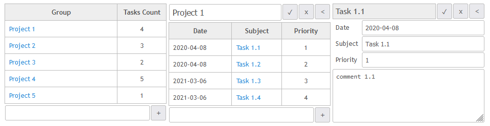

# sdm_todolist_golang_vue_spa

A project demonstrating how to use [SQL DAL Maker](https://github.com/panedrone/sqldalmaker) + Golang.

The following cases  are considered:

* [using "github.com/go-gorm/gorm"](./gorm)
* [using "github.com/jmoiron/sqlx"](./sqlx)
* [using "database/sql" directly](./no_orm)

Front-end is written in Vue.js, SQLite3 is used as a database.



sdm.xml

```xml

<sdm>

    <dto-class name="Project" ref="projects"/>

    <dto-class name="ProjectLi" ref="projects">
        <field type="int64$" column="p_tasks_count"/>
    </dto-class>

    <dto-class name="Task" ref="tasks"/>

    <dto-class name="TaskLi" ref="tasks">
        <field type="-" column="p_id"/>
        <field type="-" column="t_comments"/>
    </dto-class>

    <dao-class name="ProjectsDao">
        <crud dto="Project"/>
        <query-dto-list method="ReadAll" dto="ProjectLi" ref="get_projects.sql"/>
    </dao-class>

    <dao-class name="TasksDao">
        <crud table="tasks" dto="Task"/>
        <query-dto-list method="ReadByProject(pId)" ref="get_project_tasks.sql" dto="TaskLi"/>
    </dao-class>

</sdm>
```

Generated code in action:

```go
var (
	prDao = dbal.NewProjectsDao()
)

func ProjectCreate(ctx *gin.Context) {
	var req request.Project
	if err := request.BindJSON(ctx, &req); err != nil {
		return
	}
	if err := prDao.CreateProject(ctx, &m.Project{PName: req.PName}); err != nil {
		resp.Abort500(ctx, err)
		return
	}
	ctx.Status(http.StatusCreated)
}

func ProjectsReadAll(ctx *gin.Context) {
	all, err := prDao.ReadAll(ctx)
	if err != nil {
		resp.Abort500(ctx, err)
		return
	}
	resp.RespondWithJSON(ctx, http.StatusOK, all)
}

func ProjectRead(ctx *gin.Context) {
	var uri request.ProjectUri
	if err := request.BindUri(ctx, &uri); err != nil {
		return
	}
	pr, err := prDao.ReadProject(ctx, uri.PId)
	if err != nil {
		resp.Abort500(ctx, err)
		return
	}
	resp.RespondWithJSON(ctx, http.StatusOK, pr)
}

func ProjectUpdate(ctx *gin.Context) {
	var uri request.ProjectUri
	if err := request.BindUri(ctx, &uri); err != nil {
		return
	}
	var req request.Project
	if err := request.BindJSON(ctx, &req); err != nil {
		return
	}
	pr := &m.Project{PId: uri.PId, PName: req.PName}
	if _, err := prDao.UpdateProject(ctx, pr); err != nil {
		resp.Abort500(ctx, err)
	}
}

func ProjectDelete(ctx *gin.Context) {
	var uri request.ProjectUri
	if err := request.BindUri(ctx, &uri); err != nil {
		return
	}
	if _, err := prDao.DeleteProject(ctx, &m.Project{PId: uri.PId}); err != nil {
		resp.Abort500(ctx, err)
		return
	}
	ctx.Status(http.StatusNoContent)
}
```
